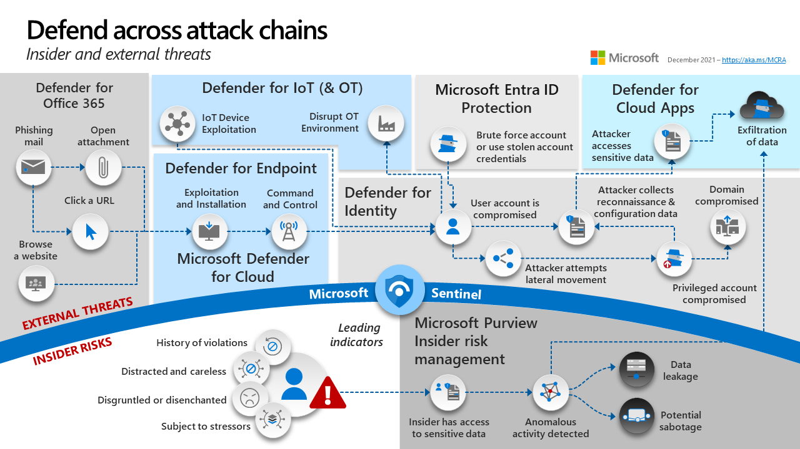

# Microsoft Defender XDR

### Intro

Microsoft Defender XDR is a very powertool toolset that has many components that make up the product.

Each piece has a core role to assist with the triage and build up the story on what outcome security researchers are searching for.

<figure><figcaption></figcaption></figure>

This a nice overview taken from MS's learning page that nicely displays the different components of Microsoft XDR.

I will skill over a lot of the topics as I already know the information so do refer to the full guide provided by Microsoft for in depth teaching.

<figure><figcaption></figcaption></figure>

Within my current SOC team, it is very in house so I  do range from a Tier 1 - 3 very quickly. There is a lot of noise that happens around within businesses, while always a challenge, this keeps me engaged and looking for new solutions as the landscape changes.

Threat Intelligence Teams (TIP) - these teams provide context and insights to support all other functions.

#### MS Security Graph API

Microsoft Graph provides a model to access the data on endpoint machines. These use REST API's or SDKs.

There are two versions of the Microsoft Graph Security API:

* Microsoft Graph REST API v1.0
* Microsoft Graph REST API Beta

#### Microsoft Defender portal

the IOC's are called entities. such as an IP address.

#### Useful AIR (automated investigations)

Basically Defender has automated actions of which are used to protect devices.

Some temporary folders that might be useful that are sometimes exploited by attackers:

Temporary folders can include the following examples:

* \users\*\appdata\local\temp\*
* \documents and settings\*\local settings\temp\*
* \documents and settings\*\local settings\temporary\*
* \windows\temp\*
* \users\*\downloads\*
* \program files\\
* \program files (x86)\*
* \documents and settings\*\users\*

#### Entra ID protection

Microsoft Entra ID Protection helps you to automatically detect, remediate, and investigate identity-based risks for your organization.

User Risk

| Risk               | Description                                                                                                                                                                 |
| ------------------ | --------------------------------------------------------------------------------------------------------------------------------------------------------------------------- |
| Unusual behavior   | The account showed unusual activity or the patterns of usage are similar to those patterns that Microsoft systems and experts have identified as attacks.                   |
| Leaked credentials | The user's credentials could have been leaked. For example, Microsoft might have found a list of leaked credentials on the dark web, which could affect your user accounts. |

#### Sign-in risk 

| Risk                          | Description                                                                                                                                                                                  |
| ----------------------------- | -------------------------------------------------------------------------------------------------------------------------------------------------------------------------------------------- |
| Unfamiliar sign-in properties | Identity Protection remembers and learns a particular user's sign-in history. For example, when a sign-in occurs from a location that's unusual for the user, a risk detection is triggered. |
| Atypical travel               | For example, when two or more sign-ins occur from distant locations in an unrealistically short time period, a risk detection is raised.                                                     |
| Malware-linked IP address     | For example, if it's known that the IP address where the sign-in originates has been in contact with an active bot server, a risk detection is raised.                                       |
| Anonymous IP address          | For example, a sign-in originates from an anonymous IP address. Because attackers can use these details to hide their real IP address or location, a risk detection is raised.               |

### Investigate risks 

| Report         | Information included                                                                                 | Actions the admin can take                                                                              | Period covered |
| -------------- | ---------------------------------------------------------------------------------------------------- | ------------------------------------------------------------------------------------------------------- | -------------- |
| Risky sign-ins | Location details, device details, sign-ins confirmed as safe, or with dismissed or remediated risks. | Confirm that sign-ins are safe or confirm that they're compromised.                                     | Last 30 days   |
| Risky users    | Lists of users at risk and users with dismissed or remediated risks. User history of risky sign-ins. | Reset user passwords, dismiss user risk, block user sign-ins, and confirm user accounts as compromised. | Not applicable |

#### MDI - Defender for Identity

Defender for Identity, often associated with Microsoft, is a cybersecurity solution designed to protect enterprise networks from various identity-based threats. It continuously monitors user activities and security events by tapping into data from Active Directory, thus creating a behavioral baseline for each user.

DC's / AD needs the senors to be on the devices to ensure that they are operating as they should.

Microsoft Defender for Identity is a cloud-based security solution that leverages your on-premises Active Directory.

More information about the sensors and how to deploy are here: [https://learn.microsoft.com/en-us/defender-for-identity/deploy/download-sensor](https://learn.microsoft.com/en-us/defender-for-identity/deploy/download-sensor)

There you would download the file and run on AD. To link up, go into the defender settings and configure the sensor.

#### Cloud Apps

