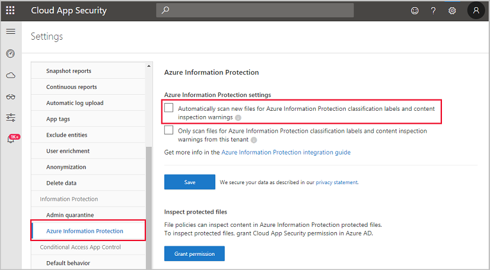

# Microsoft Defender XDR

Intro

While this not the full guide, please refer to MS learn for the full guide and learning paths. I have taken some elements from the topics of which I have used to further my own learning.&#x20;

#### MS Learn Topics:

* Introduction to Microsoft Defender XDR threat protection (✔)
* Mitigate incidents using Microsoft 365 Defender (✔)
* Protect your identities with Microsoft Entra ID Protection (✔)
* Remediate risks with Microsoft Defender for Office 365 (✔)
* Safeguard your environment with Microsoft Defender for Identity (✔)&#x20;
* Secure your cloud apps and services with Microsoft Defender for Cloud Apps (✔)

#### MS XDR - MS Security Graph

MS Graph uses REST APIs and client libraries to access data on Microsoft cloud services.

There are two versions of the Microsoft Graph Security API.

* Microsoft Graph REST API v1.0
* Microsoft Graph REST API Beta

Microsoft Entra ID

Firstly, configure your risk polices within your environment so that it will remediate.

User Risks:

| Risk               | Description                                                                                                                                                                 |
| ------------------ | --------------------------------------------------------------------------------------------------------------------------------------------------------------------------- |
| Unusual behavior   | The account showed unusual activity or the patterns of usage are similar to those patterns that Microsoft systems and experts have identified as attacks.                   |
| Leaked credentials | The user's credentials could have been leaked. For example, Microsoft might have found a list of leaked credentials on the dark web, which could affect your user accounts. |

Sign-in risk

| Risk                          | Description                                                                                                                                                                                  |
| ----------------------------- | -------------------------------------------------------------------------------------------------------------------------------------------------------------------------------------------- |
| Unfamiliar sign-in properties | Identity Protection remembers and learns a particular user's sign-in history. For example, when a sign-in occurs from a location that's unusual for the user, a risk detection is triggered. |
| Atypical travel               | For example, when two or more sign-ins occur from distant locations in an unrealistically short time period, a risk detection is raised.                                                     |
| Malware-linked IP address     | For example, if it's known that the IP address where the sign-in originates has been in contact with an active bot server, a risk detection is raised.                                       |
| Anonymous IP address          | For example, a sign-in originates from an anonymous IP address. Because attackers can use these details to hide their real IP address or location, a risk detection is raised.               |

Investigation Risks

| Report         | Information included                                                                                     | Actions the admin can take                                                                              | Period covered |
| -------------- | -------------------------------------------------------------------------------------------------------- | ------------------------------------------------------------------------------------------------------- | -------------- |
| Risky sign-ins | Location details, **device** details, sign-ins confirmed as safe, or with dismissed or remediated risks. | Confirm that sign-ins are safe or confirm that they're compromised.                                     | Last 30 days   |
| Risky users    | Lists of **users** at risk and users with dismissed or remediated risks. User history of risky sign-ins. | Reset user passwords, dismiss user risk, block user sign-ins, and confirm user accounts as compromised. | Not applicable |

#### Configuring Safe Attachments

In Defender go to Email & Collaboration > Policies & Rules > Threat policies > Safe Attachments in the Policies section

* **Off**. Attachments won't be scanned for malware.
* **Monitor**. Continues delivering the message after malware is detected and track the scanning results.
* **Block**. Blocks the current and future emails and attachments with detected malware.
* **Replace**. Blocks the attachments with detected malware but continues to deliver the message body to the user.
* **Dynamic delivery**. Immediately delivers the message body without attachments and reattaches attachments after scanning if they're found to be safe.

I have seen in the past for some use cases that you may want to use dynamic delivery to enable faster email releasing but hold the attachments for scanning before releasing to the end user.

#### Configuring Microsoft for Identity Sensors

1. Create an instance on Microsoft Defender for Identity management portal.
2. Specify an on-premises AD managed service account in the Microsoft Defender for Identity portal.
3. Download and install the sensor package.
4. Install the Microsoft Defender for Identity sensor on all domain controllers.
5. Integrate your VPN solution (optional).
6. Exclude the **sensitive accounts** you've listed during the design process.
7. Configure the required permissions for the sensor to make SAM-R calls.
8. Configure integration with Microsoft Defender for Cloud Apps.
9. Configure integration with Microsoft Defender XDR (optional).

It is best practice to use a managed service account and not a daily driver account as you  do not want to get yourself locked out or compromised that would allow possible access to your devices.

Microsoft Defender for Identity is a cloud-based security solution that leverages your on-premises Active Directory.

Currently, there is no supported integration with Microsoft Defender for Identity and Microsoft Intune.

#### Defender for Cloud

Defender for cloud is super useful when requiring to discover and control the usage of shadow IT apps being used across the business. It gives analysts like me and you great visibility of which you may have not been aware of.

The primary goal is to stop breaches and leaks in real time.

You can configure these policies within **Conditional Access App Control**

#### File Classification And Sensitivity

Classifying the type of data is the hardest step and making sure it is accurate.

I would break it down into four main phases:

1. Discover the data you want to classify
2. Classify the information accordingly
3. Protect the data (set your policy controls)
4. Monitor and reporting your data

After discovery,  enable this setting to help with the sensitive labeling.

<figure><figcaption></figcaption></figure>

Data is heavily subjective but in hindsight follows they can be categorised into:

| Type                    | Description                                                                                                                                           | My Recommendations                                                                                                                                                               |
| ----------------------- | ----------------------------------------------------------------------------------------------------------------------------------------------------- | -------------------------------------------------------------------------------------------------------------------------------------------------------------------------------- |
| Personal                | Data for personal, non-business use only.                                                                                                             | Things like your payslip is allowed to be sent to your personal email address                                                                                                    |
| Public                  | Data that can be shared for public consumption, such as marketing posters and blog posts.                                                             | This data is safe to share, \*however check with data protection and or your marketing team if you have any concerns.                                                            |
| **General**             | Data that can't be shared for public consumption, but can be shared with external partners. For example, project timelines and organizational charts. | This area is highly subjective. Use common sense here, you would not supply all of customer data to a different client that is not working on the same project for your company. |
| **Confidential**        | Data that could damage the organization if it's shared with unauthorized people. For example, sales account data and forecasts.                       | Do not share this data to external parties.                                                                                                                                      |
| **Highly confidential** | Very sensitive data that will cause serious damage if shared with unauthorized people. For example, customer details, passwords and source code.      | Do not share this data to external parties. These areas are usually core parts of your business that help it function and must be kept safe at all costs where possible.         |
