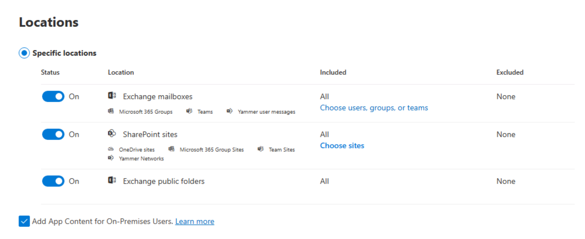

# Microsoft Purview

#### Intro

MS Purview provides a unified data governance solution to help manage and govern your on-premises, multi-cloud, and software as a service (SaaS) data.&#x20;

#### MS Learn Topics:

* Respond to data loss prevention alerts using Microsoft 365 (✔)
* Manage insider risk in Microsoft Purview (✔)
* Search and investigate with Microsoft Purview Audit (✔)
* Investigate threats with Content search in Microsoft Purview (✔)

#### DLP Alerts and Components

| DLP component | Usage                           | My Recommendations                                                                   |
| ------------- | ------------------------------- | ------------------------------------------------------------------------------------ |
| Labels        | Classify a document             | keep the labels compact and simple to use, the more data the harder it is to manage. |
| File Policy   | Used in Defender for Cloud Apps |                                                                                      |
| DLP Policy    | Used in Sharepoint Online       |                                                                                      |

#### Managing Insider risk

Insider risk management policies are created using pre-defined templates and policy conditions.

It is to note that each policy must have a template assigned in the policy creation wizard before the policy is created.

| Insider Risk Type             | Information                                                                                                                                 | My Recommendations                                                                   |
| ----------------------------- | ------------------------------------------------------------------------------------------------------------------------------------------- | ------------------------------------------------------------------------------------ |
| Data leaks                    | Accidental oversharing of information outside your organisation or theft with malicious intent                                              | Create some policies and detection rules to find these types of possible data leaks. |
| Departing employee data theft | USB drives, printing files, and copying data to personal cloud messaging and storage services near an employee's resignation and end dates. |                                                                                      |

Search and investigate with Microsoft Purview Audit

Audit (Standard) offers a maximum retention period of 180 days.

Audit log search needs to be enabled with the Get-AdminAuditLogConfig command.

MailItemsAccessed is important for providing detailed records of how and when email items are accessed, essential for managing sensitive communications.

Exporting audit logs to CSV enables extensive data manipulation and deeper insights, essential for compliance and detailed analysis.

Administrators set a priority level to determine which policy takes precedence if there are conflicts.

<figure><figcaption></figcaption></figure>

#### Exporting data using Power Query Editor

With a CSV file

<figure><figcaption></figcaption></figure>

Tranform data

<figure><figcaption></figcaption></figure>

<figure><figcaption></figcaption></figure>

<figure><figcaption></figcaption></figure>

1. Open a blank workbook in Excel and navigate to the **Data** tab. Select **From Text/CSV** to open your exported CSV file
2. Once the CSV file opens, select **Transform Data** to begin editing in the Power Query Editor.
3. Right-click **AuditData**, select **Transform**, then choose **JSON** in the **Query Editor**. This step transforms the data into a readable format, creating separate columns for each property within the JSON object.
4. Select the expand icon in the upper-right corner of the **AuditData** column to see a list of properties in the JSON objects.
5. If only some properties are visible initially, select **Load more** to display the full list of properties in the JSON objects.
6. Deselect any properties you don't need to simplify your data view. This helps in focusing only on relevant data for your analysis.
7. Then change columns on the ones you want.

You can download a maximum of 50,000 entries to a CSV file from a single audit log search. If your search results exceed this limit, consider using a narrower date range to manage the volume of data.

#### Investigating Threats with Purview

Microsoft Purview provides three eDiscovery solutions:

<figure><figcaption></figcaption></figure>

<figure><figcaption></figcaption></figure>

When creating the search, you can toggle and specify the different groupings.

View the search results and statistics

A maximum of 1,000 randomly selected items are available to preview. A maximum of 100 items from a single content location (a mailbox or a site) can be previewed.

Disabling anti-virus scanning on the folder to which you're downloading search results helps to optimize the download process. You have to be careful here when trying to attempt heavy downloads, so try to narrow down the search as best as possible before attempting to export the data.

To run a compliance filter, Organisation Management role group in the Microsoft Purview compliance portal

<figure><figcaption></figcaption></figure>
