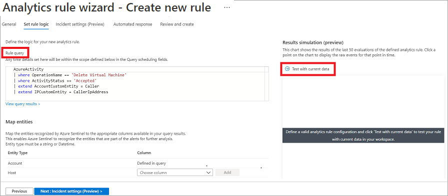

# Create detections and perform investigations using Microsoft Sentinel

#### Intro

Detection are super important when it comes to investigating threats to give you insights to act upon.

#### Deploy Sentinel using an arm template

<figure><figcaption></figcaption></figure>

The things to note here:

* Set your subscription
* Create a new resource group
* Choose your closest region (to be your data center)
* Set a name

Go to the data connectors to link to Sentinel&#x20;

Microsoft Sentinel Analytics helps you detect, investigate, and remediate cybersecurity threats.

Basically, this is the rules set for your automated detections.

#### Types of analytics rules 

Still within the same area:

* Anomaly
* Fusion
* Microsoft security
* Machine learning (ML) behavior analytics
* Scheduled alerts
* NRT (Near Real Time) rules
* Threat Intelligence

Fusion - By default, Fusion detection is enabled in Microsoft Sentinel. Microsoft is constantly updating Fusion detection scenarios for threat detection.

Scheduled Analytic rules provide the highest level of customization.

Microsoft security template rules can create incidents based on all alerts generated in Microsoft Defender for Cloud.

Scheduled rules and Microsoft Security, you can view or edit the query, filters, and includes and excludes used in the threat detection. By selecting the **Create rule** button, you can define the analytics rule logic using a wizard that helps you customize a rule from the selected template.

For Fusion and ML behavior analytics templates, you can only enable or disable them as active rules.

#### Automated response 

On the **Automated response** tab, you can define automation rules. If you select **Add new**, the **Create new automation rule** pane opens.

Creating a custom rule from a scheduled query rule type provides you with the highest level of customization.

Take note here of the different tabs int he wizard when creating the rule.

<figure><figcaption></figcaption></figure>

#### Automation and Playbooks

Automation rules allow users to centrally manage the automation of incident handling.

Automation is used for the handling of the incident response ticket. e.g assign to x user.

A playbook is a collection of response and remediation actions and logic that can be run from Microsoft Sentinel as a routine. A playbook can help automate and orchestrate your threat response.

Playbooks are generally used for more complex tasks.

Playbooks are created with Logic Apps

Analytics rules to generate alerts in Microsoft Sentinel

#### Incident evidence and entities

* Incident Evidence
* Events
* Alerts
* Bookmarks
* Incident Entities

Events link you back to one or more specific events from the Log Analytics workspace associated with Microsoft Sentinel.

