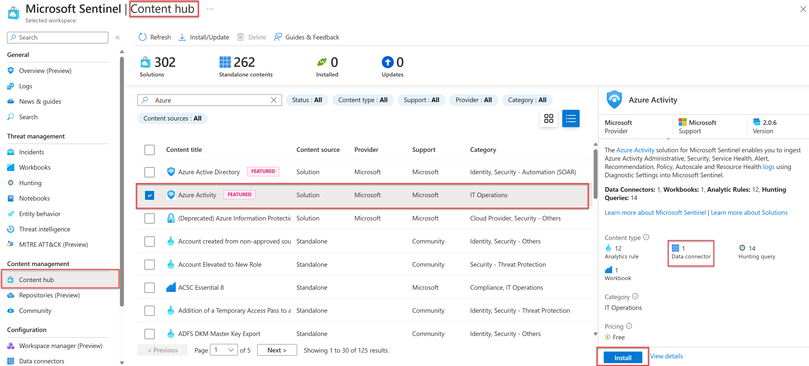

# Microsoft Sentinel connecting logs to Sentinel

The Content Hub will provide the solutions to connect your data sources with your MS Sentinel Data Connectors.

<figure><figcaption></figcaption></figure>

After when you click on the option you wa**nt you will see** the prerequisites, please make sure they are completed before you move on.

Different types of connectors:

* MS Defender XDR
  * Microsoft Defender for Endpoint
  * Microsoft Defender for Identity
  * Microsoft Defender for Office 365
  * Microsoft Defender for Cloud Apps
* Microsoft Azure Services
  * Microsoft Entra ID
  * Azure Activity
  * Microsoft Entra ID Protection
  * Azure DDoS Protection
  * Microsoft Defender for IoT
  * Azure Information Protection
  * Azure Firewall
  * Microsoft Defender for Cloud
  * Azure Web Application Firewall (WAF) (formerly Microsoft WAF)
  * Domain name server
  * Office 365
  * Windows firewall
  * Security Events
* Vendor Connectors - Microsoft Sentinel provides an ever-growing list of vendor-specific data connectors. These connectors primarily use the CEF and Syslog connector as their foundation.

If there is no connector you can use CEF or sys log connector&#x20;

( Common Event Format and Syslog connector)&#x20;

#### Syslog vs. Common Event Format

**CEF is always a superior choice because the log data is parsed into predefined fields in the CommonSecurityLog table.** Syslog provides header fields, but the raw log message is stored in a field named SyslogMessage in the Syslog table. For the Syslog data to be queried, you need to write a parser to extract the specific fields. The process to create a Parser for a Syslog message is demonstrated in a later module. most vendors would use CEF.

#### Connector architecture options 

To connect to CEF or Syslog, the agent must be deployed on dedicated Azure vm or on an on-prem system. It can be deployed automatic and manual.

For Automatic options it has to be in the Azure environment such a on Azure Arc or a vm on Azure.

On the Agents page in log analytics you will see all of the hosts connected if you have set it all up correctly.
