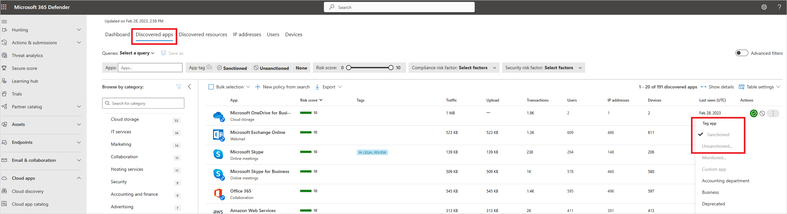

# Pfsense

## What is Pfsense?

pfSense is a firewall/router computer software distribution based on FreeBSD. The open source pfSense Community Edition and pfSense Plus is installed on a physical computer or a virtual machine to make a dedicated firewall/router for a network.

Below I will share with you setting up and configuring some basic settings to get you started. This technology request is dedicated to a good work colleague of mine that is interested in a bit of networking and is in his your years within IT, hoping this proves useful for him and others.

## Setting up Pfsense

You can install Pfsense on any compatible hardware, please check the vendor site for the systems supported. For my examples I will showcase how to set this up on vmware workstation.

First head over to the webpage and download the iso image:

<figure><figcaption></figcaption></figure>

Todays' date of download the ISO is 16/03/2024 so your should be a newer version.

_always recommended to download the latest version from the vendors' website._

Extract the zip after fully downloaded and create a new virtual machine.

_When installing the OS, please ensure that enough allocated resources are applied to the device. My own recommendations are 4GB of RAM and 40GB of storage space. I have had strange issues with less resources on my virtual machine so your results may vary._

Depending how you are networking the device I would recommend connecting up the cables (virtually) to get it all ready for the setup.

<figure><figcaption></figcaption></figure>

